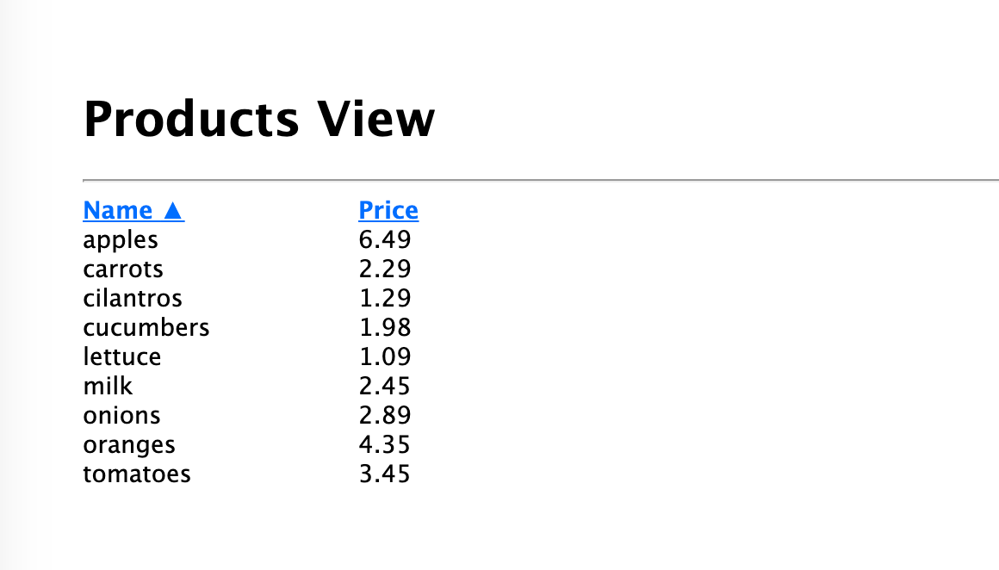

# Products View

This is a sample express/react web app that pulls a list of products from a local instance of Amazon Dynamo DB and displays it in a sortable view.

## Setting up the application locally

- Follow the instruction [here](https://docs.aws.amazon.com/amazondynamodb/latest/developerguide/DynamoDBLocal.DownloadingAndRunning.html) to download a local version of Amazon DynamoDB to your machine
- Assuming you have JRE 6.x or newer already installed on your machine, open a new terminal session, `cd` to the location of the downloaded DynamoDB and run the following command on a new terminal session to start your local db:
  `java -Dja.library.path=./DynamoDBLocal_lib -jar DynamoDBLocal.jar -sharedDb`
- Open another terminal session and clone this repository to your local machine:
  `git clone https://github.com/moeslami/products-view`
- `cd` to the repository directory and make sure you have node 10.x is installed on your machine (`node -v`)
- Install the dev and application dependencies
  `npm install`
- Run the following commands to create and seed the `Products` table
  `npm run db:up`
  `npm run db:seed`
- Run command `npm start`
- Open your browser and navigate to `http://localhost:3000`
- Done :)

